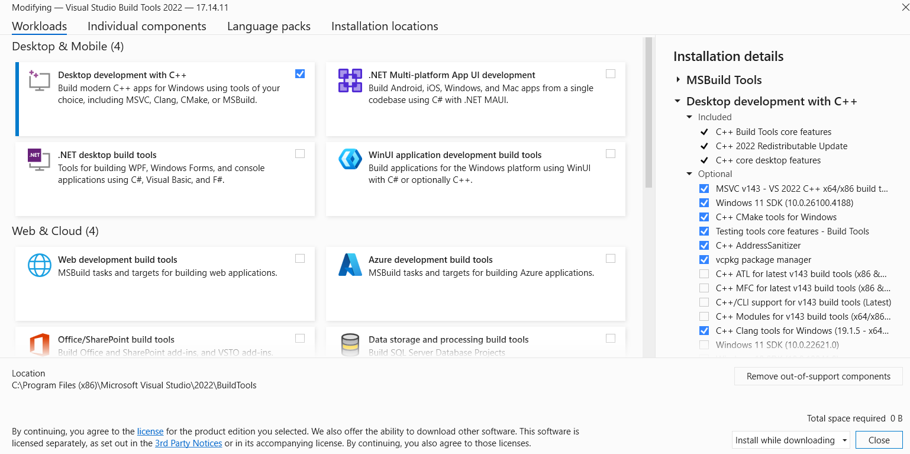

# Sand Simulation (sand-sim)
An implementation of a sandbox cellular automata.

In the sandbox, a tile particle interacts with the tiles immediately surrounding it, depending on what element the tile is.

Sand falls, water flows, steam rises, wood burns, fire extinguishes!

Written in C using [SDL2](https://www.libsdl.org/).

Personal project by Daniel Galvan.


This project, while presentable in its current form, is planned to be further extended with additional customization options, elements, and compile targets.


## Usage
### Prerequisites

#### Linux
- Contents of "sand-sim" directory as downloaded from the "releases" tab.
- [SDL2](https://github.com/libsdl-org/SDL/tree/SDL2)
- [SDL2_image](https://github.com/libsdl-org/SDL_image/tree/SDL2)

#### Windows:
- Contents of "sand-sim-mingw" or "sand-sim-msvc" directory as downloaded from the "releases" tab.
- (For MSVC port only) [Microsoft Visual C++ 2015-2022 Redistributable (x64)](https://learn.microsoft.com/en-us/cpp/windows/latest-supported-vc-redist?view=msvc-170)

On Windows, sand-sim has two versions: "sand-sim-mingw" and "sand-sim-msvc". "sand-sim-mingw" is recommended for being the more portable of the two.

Alternatively, [WSL](https://learn.microsoft.com/en-us/windows/wsl/install) can be used if running on Windows to use the Linux version.

### Installation

sand-sim must be executed with its "assets" directory in the same location as the executable.

SDL2 is required for sand-sim to run.

#### Windows

To have SDL2 installed for use by sand-sim, the provided "SDL2.dll" and "SDL2_image.dll" must be
present in the same directory as "sand-sim.exe." Inside both "sand-sim-mingw" and "sand-sim-msvc",
this structure is already setup correctly.

For the MSVC port of sand-sim only, [Microsoft Visual C++ 2015-2022 Redistributable (x64)](https://learn.microsoft.com/en-us/cpp/windows/latest-supported-vc-redist?view=msvc-170) must be installed. Simply download the x64 installer on the linked Microsoft webpage and follow the onscreen instructions.

sand-sim can then be run using the provided "sand-sim.exe" binary. 

> [!IMPORTANT]
> Windows Defender may pop up with a [warning message](https://superuser.com/questions/1553842/windows-protected-your-pc) regarding "sand-sim.exe" being an unrecognized app. Clicking "More info" and then "Run anyway" will enable the app to run. (sand-sim is not malicious, the well-documented source code can checked to verify this) 


#### Linux
On Debian-based Linux distributions, SDL2 can be installed system-wide. 

To do this, run the following:

```bash
sudo apt-get install libsdl2-2.0-0
```

SDL2_image is also required, which can be installed similarly:

```bash
sudo apt-get install libsdl2-image-2.0-0
```

Once SDL2 is installed, sand-sim can be run using the provided binary:

```bash
./sand-sim
```

For Redhat or Arch-based distros, it is straightfoward to convert these commands to YUM/DNF/pacman equivalents. Refer to the [SDL2 installation guide](https://wiki.libsdl.org/SDL2/Installation) for further instruction on these platforms. 

### Controls

Use the left mouse button the generate tile particles into the sandbox!

The selected element type may be changed using the keyboard or the mouse scroll
wheel. The key controls are:

- 1 - Sand
- 2 - Water
- 3 - Wood
- 4 - Steam
- 5 - Fire
- 6 - Fuel

Holding L-CTRL enables changing brush size when scrolling the mouse wheel.

The panel in the topleft represents your currently selected element.

Press ESC to quit the app.


### Command-Line Arguments

The size of the sandbox simulation can be customized at the command-line with
a simple command-line interface:

```bash
Usage: ./sand-sim [options]
Options:
  -h/--help      This message.
  --size         Size preset of sandbox, either "small", "medium", or "large".
  --width        Set tile width of the sandbox. Overrides --size. If specified, height must be specified too.
  --height       Set tile height of the sandbox. Overrides --size. If specified, width must be specified too.
```

Any custom widths/heights greater than 0 passed to sand-sim will be bound by the width and height of the "small" and "large" size sandboxes.

For example, on Linux, to set the sandbox to be a size of 50 x 80 would look like the following:

```bash
./sand-sim --width 50 --height 80
```

Similarly on Windows:

```bash
.\sand-sim.exe --width 50 --height 80
```

As another example, to use the "large" setting sandbox on Linux:

```bash
./sand-sim --size large
```

And on Windows:
```bash
.\sand-sim.exe --size large
```

If no command-line arguments are passed, sand-sim defaults to a 'medium' size
sandbox.

If any command-line arguments are invalid for any reason, sand-sim will repeat
its usage string.


## Building From Source

After cloning the project repository, the provided Makefiles present at the project root 
can be used to compile sand-sim once the required dependencies are in place.

### Compiling on Linux

> [!NOTE]
> The compilation instructions below assume a Debian-based Linux enviroment. 

Compiling sand-sim's Linux version on Linux requires the development versions of 
SDL2 and SDL2_image, which can be installed on Debian-based systems with the commands:

```bash
sudo apt-get install libsdl2-dev
sudo apt-get install libsdl2-image-dev
```

Compilation on Linux requires clang, which can be installed with the command:

```bash
sudo apt-get install clang
```

Once clang is installed, sand-sim can be built from the project root directory using Make and the provided Makefiles. To build the Linux version, simply call Make:

```bash
make
```

This will produce a binary called "sand-sim" which can be executed to run the program.

It is instead possible to cross-compile the Windows versions of sand-sim on Linux, such as
if running on WSL. 
To do this, MinGW64 and pkg-config are further required, both of which can be installed like so:

```bash
sudo apt-get install mingw-w64
sudo apt-get install pkg-config
```

sand-sim can then be built for Windows on Linux from the project root directory with the
command:

```bash
make sand-sim.exe
```

The necessary SDL2 Windows pre-compiled MinGW binaries are provided with the source of
sand-sim and no external installation of SDL2 is necessary for compiling the Windows version.

### Compiling on Windows

Compiling sand-sim on Windows requires the Visual Studio Build Tools 2022.

On the command line, the installer for Build Tools can be downloaded using [winget](https://learn.microsoft.com/en-us/windows/package-manager/winget/), the official Windows package manager, like so:

```bash
winget install --id=Microsoft.VisualStudio.2022.BuildTools -e
```

Alternatively, the Visual Studio Installer for Build Tools can be downloaded [from
Microsoft's webpage](https://visualstudio.microsoft.com/downloads/?q=build+tools)

Follow the link above and scroll down to "Tools for Visual Studio" under "All Downloads". Download
and run "vs_BuildTools.exe" from the downloadable "Build Tools for Visual Studio 2022". 

Once inside the Visual Studio Installer, enable "Desktop development with C++" and, under the
"optional" packages, enable "C++ Clang tools for Windows" as shown below:




Click "install" in the bottom right and allow the Visual Studio Installer to install clang and MSVC.

Once finished, sand-sim's Windows version can be built from the project root directory by
running the "build.bat" auxiliary script:

```bash
.\build.bat
```

This will produce a binary called "sand-sim.exe" which can be executed to run the program. 
The build script will also generate the necessary SDL2 DLLs next to "sand-sim.exe" to
allow the binary to run.

As with the MinGW build, the necessary pre-compiled MSVC builds of SDL2 are provided
with the source of sand-sim.

As well, if compiling on Windows, no additional installation of the Microsoft Visual C++ 2015-2022 Redistributable is necessary, since this C runtime comes bundled with the "Desktop development with C++"
package.

## Project and Source File Organization

- "assets/" - Visual and audio assets used in GUI.
- "libs/" - Pre-compiled third-party library code and headers.
- "src/sandbox.c" - Core sandbox simulation logic.
- "src/gui.c" - Implementation of GUI for displaying sandbox in SDL2.
- "src/utils.c" - General-purpose utility functions.
- Makefile.common - Build definitions common to both Linux and Windows ports.

