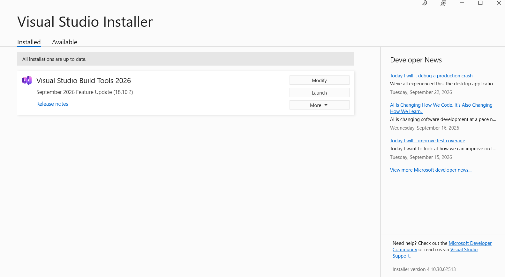
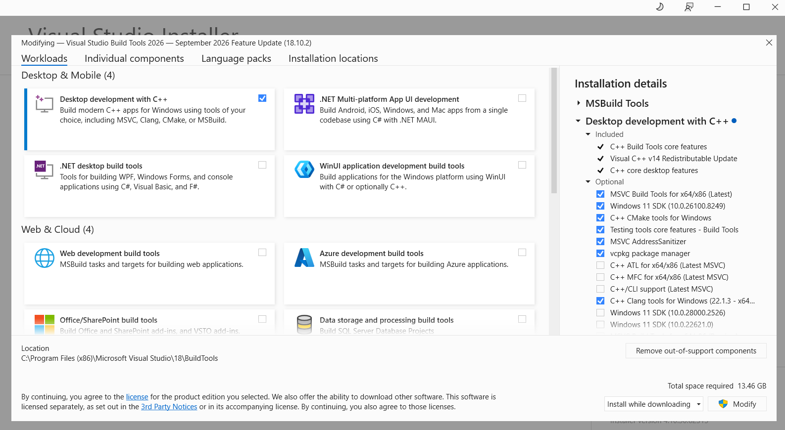

# Sand Simulation (sand-sim)
An implementation of a sandbox cellular automata.

In the sandbox, a tile particle interacts with the tiles immediately surrounding it, depending on what element the tile is.

Sand falls, water flows, steam rises, wood burns, fire extinguishes!

Written in C23 using [SDL3](https://www.libsdl.org/).

Personal project by Daniel Galvan.


This project is to be continuously expanded with additional customization options and compile targets.

## Usage
### Prerequisites

#### Linux
- Contents of `sand-sim` directory as downloaded from the "releases" tab.
- [SDL3](https://github.com/libsdl-org/SDL)
- [SDL3_image](https://github.com/libsdl-org/SDL_image)

#### Windows
- Contents of `sand-sim-mingw` or `sand-sim-msvc` directory as downloaded from the "releases" tab.
- (For MSVC version only) [Microsoft Visual C++ v14 Redistributable (x64)](https://learn.microsoft.com/en-us/cpp/windows/latest-supported-vc-redist?view=msvc-170)

On Windows, sand-sim has two versions: `sand-sim-mingw` and `sand-sim-msvc`. `sand-sim-mingw` is recommended for being the more portable of the two.

Alternatively, [WSL](https://learn.microsoft.com/en-us/windows/wsl/install) can be used if running on Windows to use the Linux version.

### Installation

sand-sim must be executed with its `assets` directory in the same location as the executable.

SDL3 is required for sand-sim to run.

#### Windows

To have SDL3 installed for use by sand-sim, the provided `SDL3.dll` and `SDL3_image.dll` must be
present in the same directory as `sand-sim.exe`. Inside both `sand-sim-mingw` and `sand-sim-msvc`,
this structure is already setup correctly.

For the MSVC port of sand-sim only, [Microsoft Visual C++ v14 Redistributable (x64)](https://learn.microsoft.com/en-us/cpp/windows/latest-supported-vc-redist?view=msvc-170) must be installed. Download the x64 installer on the Microsoft webpage and follow the onscreen instructions.

sand-sim can then be run using the provided `sand-sim.exe` binary. 

> [!IMPORTANT]
> Windows Defender may pop up with a [warning message](https://superuser.com/questions/1553842/windows-protected-your-pc) regarding `sand-sim.exe` being an unrecognized app. Clicking "More info" and then "Run anyway" will enable the app to run. (sand-sim is not malicious, the source code can checked to verify this) 


#### Linux
On Debian-based Linux distributions, SDL3 can be installed system-wide. 

To do this, run the following:

```bash
sudo apt install libsdl3-0
```

SDL3_image is also required, which can be installed similarly:

```bash
sudo apt install libsdl3-image0
```

Once SDL3 is installed, sand-sim can be run using the provided binary:

```bash
./sand-sim
```

### Controls

Use the left mouse button the generate tile particles into the sandbox!

Use the right mouse button to switch the tile placement mode:
- Pencil - Place tiles, new tiles to be placed highlighted by a square 'ghost'.
- Eraser - Delete tiles, tiles to be removed highlighted by a red grid.
- Brush - Replace tiles hovered over with currently selected tile type.

The selected tile type may be changed using the keyboard or the mouse scroll
wheel. Below is the key to type mapping:

- 1 - Sand
- 2 - Water
- 3 - Wood
- 4 - Steam
- 5 - Fire
- 6 - Fuel

Holding L-CTRL enables changing brush size when scrolling the mouse wheel.

The panel in the topleft represents your currently selected element.

Press ESC to quit the app.


### Command-Line Arguments

The size of the sandbox simulation can be customized at the command-line with
a simple command-line interface:

```bash
Usage: ./sand-sim [options]
Options:
  -h/--help      This message.
  --size         Size preset of sandbox, either "small", "medium", or "large".
  --width        Set tile width of the sandbox. Overrides --size. If specified, height must be specified too.
  --height       Set tile height of the sandbox. Overrides --size. If specified, width must be specified too.
```

Any custom widths/heights greater than 0 passed to sand-sim will be bound by the width and height of the "small" and "large" size sandboxes.

For example, on Linux, to set the sandbox to be a size of 50 x 80 would look like the following:

```bash
./sand-sim --width 50 --height 80
```

Similarly on Windows:

```bash
.\sand-sim.exe --width 50 --height 80
```

As another example, to use the "large" setting sandbox on Linux:

```bash
./sand-sim --size large
```

And on Windows:
```bash
.\sand-sim.exe --size large
```

If no command-line arguments are passed, sand-sim defaults to a 'medium' size
sandbox.

If any command-line arguments are invalid for any reason, sand-sim will repeat
its usage string.


## Building From Source

After cloning the project repository, the provided Makefiles present at the project root 
can be used to compile sand-sim once the required dependencies are in place.

### Compiling on Linux

> [!NOTE]
> The compilation instructions below assume a Debian-based Linux enviroment. 

Compiling sand-sim's Linux version requires the development versions of 
SDL3 and SDL3_image, which can be installed on Debian-based systems with the commands:

```bash
sudo apt install libsdl3-dev
sudo apt install libsdl3-image-dev
```

Compilation on Linux requires clang and pkg-config, which can be installed with the commands:

```bash
sudo apt install pkg-config
sudo apt install clang
```

Once the above is installed, sand-sim can be built from the project root directory using Make and the provided Makefiles. To build the Linux version, call Make:

```bash
make
```

This will produce a binary called `sand-sim` which can be executed to run the program.

If developing sand-sim, the provided `.clang-tidy` file enables usage of [clangd](https://clangd.llvm.org/) as a C language server.

To generate the requisite `compile_commands.json` required by clangd, use [Bear](https://github.com/rizsotto/Bear).

First install Bear:
```bash
sudo apt install bear
```

Then use Bear to generate a compilation database from sand-sim's compile command:
```bash
make clean
bear -- make
```

Now opening the project root directory:
```bash
code .
```
will allow an installed [clangd VSCode extension](https://marketplace.visualstudio.com/items?itemName=llvm-vs-code-extensions.vscode-clangd) to recognize sand-sim's dependencies and provide
in-editor documentation.

With a created `compile_commands.json`, the [Clang Static Analyzer](https://clang-analyzer.llvm.org/) can be used via clang-tidy to analyze the sand-sim source against the defined checks in `.clang-tidy`.

First install clang-tidy:

```bash
sudo apt install clang-tidy
```

Then run clang-tidy static analysis against the source code via `compile_commands.json` like so:

```bash
run-clang-tidy
```

The clang-tidy conventions used by sand-sim follow those specified by the [RHEL docs](https://developers.redhat.com/blog/2021/04/06/get-started-with-clang-tidy-in-red-hat-enterprise-linux#using_clang_tidy_in_red_hat_enterprise_linux) and the [official LLVM docs](https://clang.llvm.org/extra/clang-tidy/).

A debug compile of sand-sim which is enabled to run with [AddressSanitizer](https://releases.llvm.org/20.1.0/tools/clang/docs/AddressSanitizer.html) is also available.

The debug sand-sim compile additionally disables optimization and generates DWARF symbols for use with LLDB. 
In order to use it, the llvm toolchain must be installed:

```bash
# Enable usage of `llvm-symbolizer` in PATH.
sudo apt install llvm
```

sand-sim can then be compiled for debugging like so:

```bash
make debug
```

And run with Address+LeakSanitizer stack tracing like so:
```bash
ASAN_OPTIONS=fast_unwind_on_malloc=false ./sand-sim
```


It is instead possible to cross-compile the Windows versions of sand-sim on Linux, such as if running on WSL. 
To do this, the 64-bit Win32 implementation of [MinGW64](https://www.mingw-w64.org/getting-started/debian/) is required:

```bash
# Alternatively, the more general `apt install mingw-w64` also works but will install many other mingw components not required by sand-sim. 
sudo apt install gcc-mingw-w64-x86-64-win32
```

sand-sim can then be built for Windows on Linux from the project root directory with the command:

```bash
make sand-sim.exe
```

The necessary SDL3 Windows pre-compiled MinGW binaries are provided with the source of
sand-sim and no external installation of SDL3 is necessary for compiling the Windows version.

### Compiling on Windows

Compiling sand-sim on Windows requires the Visual Studio Build Tools 2026.

On the command line, the installer for Build Tools can be downloaded using [winget](https://learn.microsoft.com/en-us/windows/package-manager/winget/), the official Windows package manager, like so:

```bash
winget install --id=Microsoft.VisualStudio.BuildTools -e
```

Alternatively, the Visual Studio Installer for Build Tools can be downloaded [from
Microsoft's webpage](https://visualstudio.microsoft.com/downloads/?q=build+tools)

Follow the link above and scroll down to "Tools for Visual Studio" under "All Downloads". Download
and run `vs_BuildTools.exe` from the downloadable "Build Tools for Visual Studio 2026". 

Once installed (using either method above), open the Visual Studio Installer and click `Modify` on 'Visual Studio Build Tools 2026':



Inside Build Tools workloads, enable "Desktop development with C++" and (under the
"Optional" packages) enable "C++ Clang tools for Windows" as shown below:



Click "Modify" on the bottom right of the installer and allow the Visual Studio Installer to install clang and MSVC.

Once finished, sand-sim's Windows version can be built from the project root directory by
running the `build.bat` auxiliary script:

```bash
.\build.bat
```

This will produce a binary called `sand-sim.exe` which can be executed to run the program. 
The build script will also generate the necessary SDL3 DLLs next to `sand-sim.exe` to
allow the binary to run.

As with the MinGW build, the necessary pre-compiled MSVC builds of SDL3 are provided
with the source of sand-sim.

As well, if compiling on Windows, no additional installation of the Microsoft Visual C++ v14 Redistributable is necessary, since the Microsoft C runtime comes bundled with the "Desktop development with C++" workload.

Developing sand-sim as a solution inside Windows Visual Studio is not supported. Prefer instead to use a Linux environment on Windows via WSL2.

## Project and Source File Organization

- `assets/` - Visual and audio assets used in GUI.
- `libs/` - Pre-compiled third-party library code and headers.
- `src/sandbox.c` - Core sandbox simulation logic.
- `src/gui.c` - Implementation of GUI for displaying sandbox in SDL3.
- `src/utils.c` - General-purpose utility functions.
- `src/main.c` - Program entry-point and parser of command-line arguments.
- `GNUmakefile` + `Makefile` - Makefiles specific to GNUmake and Microsoft's NMAKE.
- `Makefile.common` - Build definitions common to both Linux and Windows ports.
- `build.bat` - Auxiliary script driving Windows compilation using clang in MSVC-mode.

